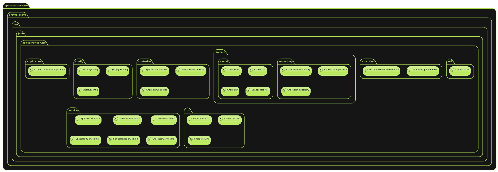
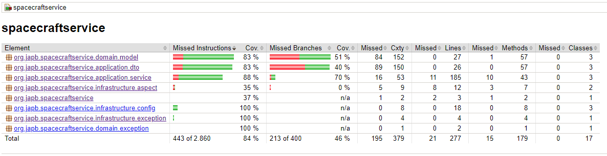

# Proyecto de Gestión de Series y Naves Espaciales 📋
Este proyecto es una aplicación Java Spring Boot que gestiona información sobre series, películas, naves espaciales y personajes. La aplicación expone una API RESTful para realizar operaciones CRUD sobre estas entidades. Además, se ha implementado seguridad básica utilizando Spring Security.

# Tecnologías Utilizadas 🛠️
* Java 21
* Spring Boot
* Spring Data JPA
* Spring Security
* H2 Database
* Hibernate Validator (Jakarta Validation)
* JUnit 5
* Mockito
* Lombok
* Flyway
* Maven
## Diagrama de la solución 📊️
- Diagrama de clases de la solución inicial:
  

# Configuración del Proyecto
## Dependencias
Las dependencias principales utilizadas en el proyecto se encuentran en el archivo pom.xml:
## Configuración de Seguridad
La seguridad se configura en la clase SecurityConfig:

## Configuración de Base de Datos
La configuración de la base de datos se encuentra en el archivo application.yml:
### Scripts de Datos de Prueba
```
-- Datos para la tabla series_movie
INSERT INTO TB_SERIES_MOVIE (title, release_date, type) VALUES ('Star Wars: Episode IV', '1977-05-25', 'Movie'),
('Star Trek: The Original Series', '1966-09-08', 'Series'),
('Battlestar Galactica', '2004-10-18', 'Series');

-- Datos para la tabla spacecraft
INSERT INTO TB_SPACECRAFT (name, model, manufacturer, length, crew_capacity, passenger_capacity, series_movie_id) VALUES
('Millennium Falcon', 'YT-1300 light freighter', 'Corellian Engineering Corporation', 34.75, 6, 6, 1),
('USS Enterprise', 'Constitution-class', 'Starfleet', 288.6, 430, 0, 2),
('Galactica', 'Battlestar', 'Colonial Fleet', 1438, 2000, 5000, 3);

-- Datos para la tabla character
INSERT INTO TB_SPACE_CHARACTER (name, role, species, gender, birth_date, spacecraft_id) VALUES
('Han Solo', 'Captain', 'Human', 'Male', '1942-07-12', 1),
('Chewbacca', 'Co-pilot', 'Wookiee', 'Male', '0000-01-01', 1), -- El año 200 BBY no puede representarse en formato de fecha estándar, por lo que se usa un placeholder
('James T. Kirk', 'Captain', 'Human', 'Male', '2233-03-22', 2),
('Spock', 'First Officer', 'Vulcan', 'Male', '2230-01-06', 2),
('William Adama', 'Commander', 'Human', 'Male', '1945-10-19', 3),
('Kara Thrace', 'Pilot', 'Human', 'Female', '1980-01-10', 3);
```
## Ejecución de Pruebas
Las pruebas unitarias se han implementado utilizando JUnit 5 y Mockito.
- Grafico cobertura Jacoco
  

## Ejecución del Proyecto
Para ejecutar el proyecto, sigue estos pasos:

## Clona el repositorio.
 1. Navega hasta el directorio del proyecto.
 2. Ejecuta mvn spring-boot:run.
 3. La aplicación estará disponible en http://localhost:8080/swagger-ui/index.html#/ y el H2 Console en http://localhost:8080/h2-console.


# Docker
La tecnología Docker no solo ofrece la capacidad para ejecutar los contenedores, sino que también facilita su creación y diseño, así como el envío y el control de versiones de las imágenes, entre otras funciones.
## Creación del Dockerfile
En el directorio raíz del proyecto (spacecraftservice), existe un archivo llamado Dockerfile con el siguiente contenido:
```
# imagen base de OpenJDK 21
FROM adoptopenjdk:21-jdk-hotspot
LABEL authors="jalva"

# Establece el directorio de trabajo dentro del contenedor
WORKDIR /app

# Copia el JAR generado por Maven a la imagen Docker
COPY target/spacecraftservice-0.0.1-SNAPSHOT.jar /app/app.jar

# Comando para ejecutar la aplicación al iniciar el contenedor
CMD ["java", "-jar", "app.jar"]
```
## Construcción de la imagen Docker
A continuación, desde la línea de comandos, navega al directorio donde se encuentra tu Dockerfile y ejecuta el siguiente comando para construir la imagen Docker:
```
docker build -t spacecraft-service:latest .
```
* spacecraft-service es el nombre que le das a tu imagen Docker.
* latest es la etiqueta de la imagen.
## Ejecución del contenedor Docker
  Una vez que la imagen Docker se ha construido correctamente, puedes ejecutarla como un contenedor Docker:

```docker run -p 8080:8080 spacecraft-service:latest```
* `8080:8080` mapea el puerto `8080` del contenedor al puerto `8080` de tu máquina local. Ajusta los puertos según lo necesites para tu aplicación Spring Boot.

# API Endpoints
## SeriesMovieController
* GET /api/series-movies: Obtener todas las series y películas.
* GET /api/series-movies/{id}: Obtener una serie o película por su ID.
* POST /api/series-movies: Crear una nueva serie o película.
* PUT /api/series-movies/{id}: Actualizar una serie o película existente.
* DELETE /api/series-movies/{id}: Eliminar una serie o película.
## SpacecraftController
* GET /api/spacecrafts: Obtener todas las naves espaciales.
* GET /api/spacecrafts/{id}: Obtener una nave espacial por su ID.
* POST /api/spacecrafts: Crear una nueva nave espacial.
* PUT /api/spacecrafts/{id}: Actualizar una nave espacial existente.
* DELETE /api/spacecrafts/{id}: Eliminar una nave espacial.
## CharacterController
* GET /api/characters: Obtener todos los personajes.
* GET /api/characters/{id}: Obtener un personaje por su ID.
* POST /api/characters: Crear un nuevo personaje.
* PUT /api/characters/{id}: Actualizar un personaje existente.
* DELETE /api/characters/{id}: Eliminar un personaje.
- Grafico Swagger
  
# Contribución
Si deseas contribuir a este proyecto, por favor sigue los siguientes pasos:
1. Haz un fork del proyecto.
2. Crea una rama para tu nueva característica (git checkout -b feature/nueva-caracteristica).
3. Haz commit de tus cambios (git commit -am 'Agrega nueva característica').
4. Haz push a la rama (git push origin feature/nueva-caracteristica).
5. Abre un Pull Request.

# Licencia
Este proyecto está licenciado bajo la Licencia MIT. Consulta el archivo LICENSE para obtener más información.

## Autor ✒
* **Jaime Peredo** - *Desarrollador* - [jperedo](https://gitlab/jperedo)
